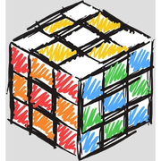

# Cubeit

A daily Rubik's Cube scramble with a shared leaderboard. Everyone gets the
same cube each day, solves it in the browser, and the clock stops the moment
it comes together.

<p align="center">
  
</p>

## How it works

**One run per.** Like Wordle, you get a single attempt per day. It resets at 00:00 UTC, and the finished board moves to the archive.

**Solves are verified.** The browser submits the move sequence behind your
time, and the server replays it against that day's scramble. A time that
doesn't come with moves that genuinely solve the cube is rejected.

## Pages

| Page | What it does |
|------|--------------|
| `/` | Daily scramble, the 3D cube, and the live leaderboard |
| `/archive` | Every past day, with its scramble and winner |
| `/timer` | A practice speedmat for solving a real cube |
| `/solver` | Any-to-any solver: cube state → target pattern |

## Playing

Turn faces with the on-screen buttons or the keyboard — <kbd>u</kbd>
<kbd>r</kbd> <kbd>f</kbd> <kbd>d</kbd> <kbd>l</kbd> <kbd>b</kbd>, with
<kbd>shift</kbd> for a counter-clockwise turn. Drag the cube to look around.

The clock starts on your first turn, so studying the scramble is free, and it
stops by itself the instant the cube is solved. Then you name your time and
post it.

### Speedmat

For timing a real cube, `/timer` behaves like a competition timer: hold
<kbd>space</kbd>, wait for the green *ready*, release to start, and press any
key to stop. It tracks best, mean, ao5 and ao12 for the session, stored in
your browser. Nothing here reaches the leaderboard — a solve away from the 3D
cube can't be verified.


## Layout

```
app.py                 routes, leaderboard, daily scramble, solve verification
cube.py                cube model: facelets, turns, scrambles, kociemba solving
static/cube-engine.js  the same cube model in the browser, plus the three.js cube
static/daily.js        the daily challenge
static/timer.js        the speedmat
static/solver.js       the any-to-any solver
```

`cube.py` and `cube-engine.js` implement face turns identically — that's what
lets the browser detect a solve instantly while the server independently
confirms it.

## Notes

`kociemba` is a C extension and only `/solver` needs it. If it fails to build,
that page degrades to a notice and everything else keeps working.

The daily cube and the solver load three.js from a CDN. The speedmat doesn't
load anything external.